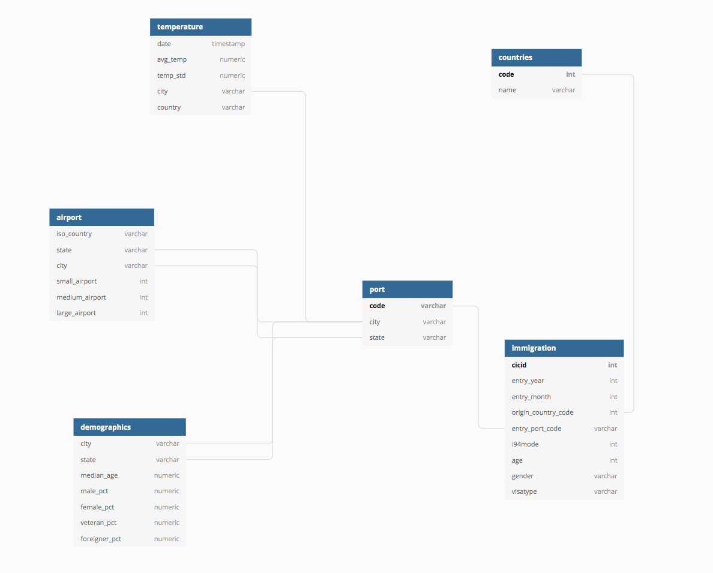

# Project Description
- Each year a great number of people come to the US with differnt VISA types. It's interesting to see if there are some trends in the destination cities they would like to go
- The aim of this project is to create an ETL pipeline to generate a set of tables so that analysts can use to explore and answer questions, sucha as:
  * Which city attracts the most student/business/immigration visa holders
  * The relationship between the number of immigrants and the features of the city, e.g. weather, demographics, and airport numbers

# Data Sources
- I94 Immigration Data: This data comes from the US National Tourism and Trade Office. Here's the [Link](https://travel.trade.gov/research/reports/i94/historical/2016.html)
- World Temperature Data: This dataset came from Kaggle. You can read more details from [here](https://www.kaggle.com/berkeleyearth/climate-change-earth-surface-temperature-data)
- U.S. City Demographic Data: This data comes from OpenSoft. You can read more details from [here](https://public.opendatasoft.com/explore/dataset/us-cities-demographics/export/)
- Airport Code Table: This is a simple table of airport codes and corresponding cities. You can read more details from [here](https://datahub.io/core/airport-codes#data)

# Data Pipeline Design
The whole data processing pipeline is based on data lake design. The reason to choose data lake is due to its flexibility in altering schema and avoid the burden of maintaing a database.

## Infrastructure Setup
- S3 is chosen as the data storage for raw data and transformed data due to its cheap price and compatibility with most of data processing engines
- Spark is chosed as the data processing engine due to its parallel processing nature and the flexibility to scale up when data size is increased dramatically
- Airflow is used as the data pipeline orchestarting tool. The nature of task dependencies within a DAG (Directed Acyclic Graph) in Airflow allows easy monitoring of data pipeline

## Data Model
- A star shema is choosen as the data model due to its benefits of using denormalized tables, simplifying queries and fast aggregations. Following is the list of tables generated:
    1. Denormalized `immigration` table: it has information about the origin country and the entry port, and it also contains basic information of visa holders, like age, gender, and visa type
    2. Normalized `port` table: it has unique code for I94 entry port and its corresponding city and state
    3. Normalized `countries` table: it contains the country code and its corresponding name
    4. Normalized `temperature` table: it contains average temperature of the target city and the measurement date
    5. Normalized `airport` table: it contains information of the number of different types of airport of each city
    6. Normalized `demographics` table: it contains the demographics information of each city
- Some use cases:
    1. If we want to analyze relationship between immigration and destination city demographics, we can create an analytics table by joining `immigration` table with `demographics` table
    2. If we want to explore relationship between immigration and tranportation convenience of destination city, we can create an analytics table by joining `immigration` table with `airport` table

Tables are normalized for the benefits of efficient data updates. Please see data dictionary in the `data_dictionary` folder for the table field description.

## ETL Pipeline

# Follw-up Questions
1. The data was increased by 100x

We can increase the number of the worker nodes of the Spark cluster. 

2. Data must be updated on a daily basis by 7am every day

- Schedule data pipeline DAG to run daily at early morning (e.g. 5am)
- Use DAG retry feature. If any task fails, send an email for notification

3. Data need to be accessed by 100+ people 

We can load analytics data to Redshift and scale the cluster if the data usage increase dramatically 
